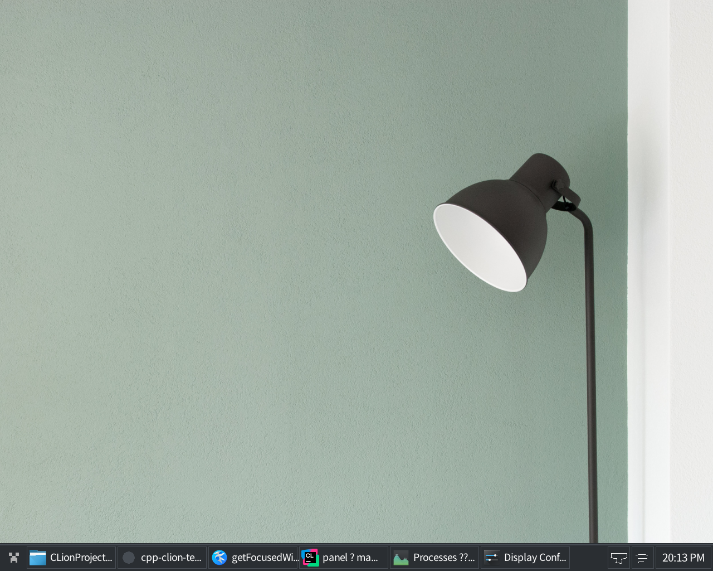

# Panel
A panel I made for fun and to learn a bit about x11, the panel is a bit buggy and doesn't run quite that well.  
Nobody should use this for anything serious. It's only useful as a learning resource.
It uses about 40mb of ram.

# NOTES:
If you run it with two displays you might get problems

# Installation:
Install the raylib and x11 dev libraries on your linux distribution.
Then run the following commands to build program:

```bash
mkdir build
cd build
cmake ..
make
```

# Usage:
After compiling it using CLion or a cmake you can add it to your autostart to run automatically on boot.

# Screenshot:

